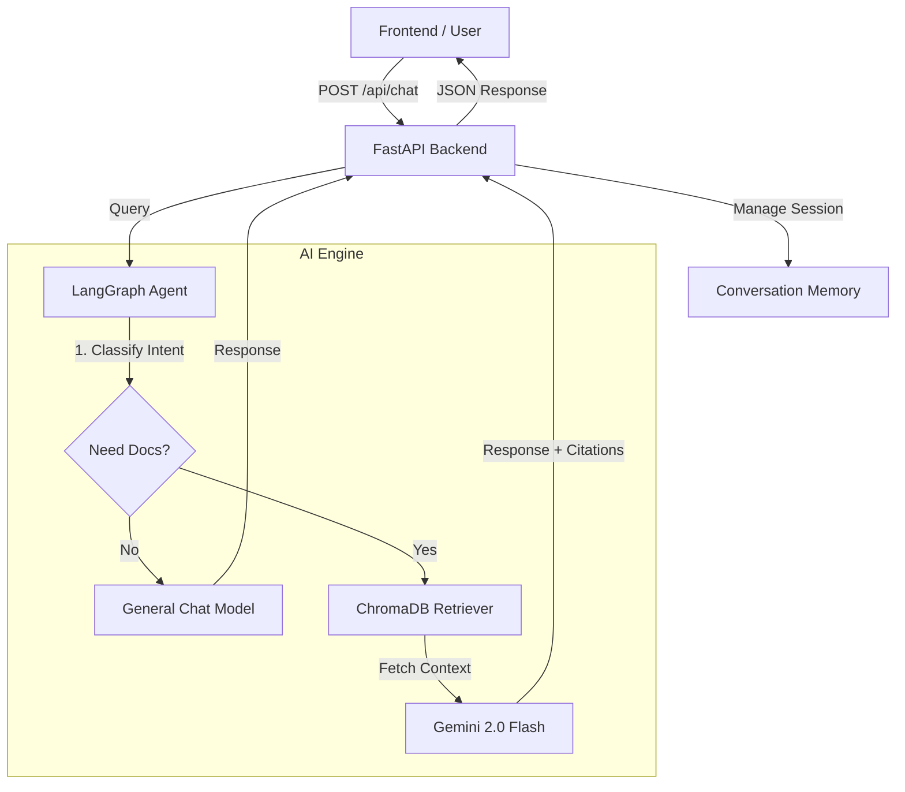

# Nigeria Tax Reform Q&A Assistant

An intelligent chatbot application designed to help users understand the 2024 Nigerian tax reform bills. This project provides clear, accessible answers about tax exemptions, new levies, VAT changes, and personal income tax implications.

## 🚀 Features

- **Interactive Chat Interface** - Ask questions about tax reforms in natural language
- **Smart Question Cards** - Pre-configured questions covering key tax topics:
  - Cryptocurrency taxation and transaction monitoring
  - VAT and digital compliance requirements
  - Company income tax changes
  - Freelance and digital income taxation
- **Dark Mode Support** - Toggle between light and dark themes
- **Chat History** - Save and revisit previous conversations
- **Responsive Design** - Works seamlessly on desktop and mobile devices
- **Real-time AI Responses** - Powered by Google's Gemini AI

## 🛠️ Technology Stack

### Frontend

- **React 19.2** - Modern UI library
- **Vite 7.3** - Fast build tool and dev server
- **Tailwind CSS 4.1** - Utility-first CSS framework
- **Lucide React** - Beautiful icon library
- **ESLint** - Code quality and consistency

### Backend

- **Python** - Backend API
- **FastAPI** - Modern web framework
- **Google Gemini AI** - Natural language processing
- **ChromaDB** - Vector database for document retrieval

## 📋 Prerequisites

Before you begin, ensure you have:

- **Node.js** (v18 or higher)
- **npm** or **yarn**
- **Python 3.12** (for backend)
- **Google Gemini API Key**

## 🚀 Frontend Setup

### 1. Navigate to Frontend Directory

```bash
cd "frontend docs/frontend-tax"
```

### 2. Install Dependencies

```bash
npm install
```

### 3. Configure Environment Variables

Create a `.env` file in the `frontend-tax` directory:

```env
VITE_API_URL=http://localhost:8000
```

### 4. Start Development Server

```bash
npm run dev
```

The frontend will be available at `http://localhost:5173`

### 5. Build for Production

```bash
npm run build
```

## 🔌 Backend Setup & Connection

### 1. Navigate to Backend Directory

```bash
cd <backend-directory>
```

### 2. Create Python Virtual Environment

```bash
python -m venv .venv
.venv\Scripts\activate  # Windows
```

### 3. Install Backend Dependencies

```bash
pip install -r requirements.txt
```

### 4. Configure Backend Environment

Create a `.env` file in the backend directory:

```env
GEMINI_API_KEY=your_gemini_api_key_here
```

### 5. Start Backend Server

```bash
uvicorn main:app --reload --host 0.0.0.0 --port 8000
```

The backend API will be available at `http://localhost:8000`

### 6. Verify Connection

- Frontend should automatically connect to `http://localhost:8000`
- Check browser console for any connection errors
- Test by asking a question in the chat interface

## 📁 Project Structure

```
Tax_Reform_Project/
├── frontend docs/
│   └── frontend-tax/
│       ├── src/
│       │   ├── components/     # React components
│       │   │   ├── Welcome.jsx
│       │   │   ├── ChatDisplay.jsx
│       │   │   ├── Sidebar.jsx
│       │   │   └── ...
│       │   ├── utils/          # Utility functions
│       │   ├── App.jsx         # Main app component
│       │   └── main.jsx        # Entry point
│       ├── public/             # Static assets
│       ├── index.html
│       ├── package.json
│       └── vite.config.js
├── backend/                    # Backend API (if applicable)
├── .gitignore
└── README.md
```

## 🎨 Available Scripts

### Frontend

- `npm run dev` - Start development server
- `npm run build` - Build for production
- `npm run preview` - Preview production build
- `npm run lint` - Run ESLint

## 🌐 Deployment

### Frontend Deployment (Firebase Hosting)

```bash
npm run build
firebase deploy
```

### Backend Deployment

Deploy to your preferred platform (Heroku, Railway, Google Cloud, etc.) and update the `VITE_API_URL` environment variable accordingly.

## 🔧 Configuration

### Connecting to Different Backend

Update the `.env` file in the frontend directory:

```env
VITE_API_URL=https://your-backend-url.com
```

### API Endpoints

The frontend expects the following backend endpoints:

- `POST /chat` - Send chat messages and receive AI responses
- `GET /health` - Health check endpoint

## 🐛 Troubleshooting

### Frontend won't connect to backend

- Verify backend is running on `http://localhost:8000`
- Check `.env` file has correct `VITE_API_URL`
- Ensure no CORS issues (backend should allow frontend origin)

### Build errors

- Delete `node_modules` and run `npm install` again
- Clear Vite cache: `rm -rf .vite`

### Dark mode issues

- Clear browser cache
- Check browser console for errors

## 📝 License

This project is part of the Nigeria Tax Reform initiative.

## 👥 Contributing

Contributions are welcome! Please follow the existing code style and submit pull requests for review.

## 📧 Support

For questions or issues, please open an issue in the repository.
# 🇳🇬 Nigeria Tax Reform Bills Q&A Assistant  
### Backend & AI Engine

**Project:** Agentic RAG Capstone  
**Team Role:** Backend & AI Engineering  
**Status:** Production Ready

---

## 📋 Overview

This repository contains the complete server-side infrastructure for the **Nigeria Tax Reform Q&A Assistant**.  
It combines a state-of-the-art **Agentic AI Engine** (built with **LangGraph** and **Google Gemini**) with a robust **FastAPI** backend to serve intelligent, citation-backed answers to frontend clients.

---

## 🌟 Key Features

### 🧠 AI Engine

- **Agentic Workflow** – Intelligent decision-making on when to retrieve documents versus when to respond conversationally.
- **Conditional Retrieval** – Reduces latency and cost by querying the vector database only for policy-related questions.
- **Citation-Backed Answers** – All policy claims are grounded in official **2024 Nigeria Tax Reform Bills**.
- **Conversation Memory** – Maintains multi-turn context (e.g., “What about VAT?” following “Will I pay more tax?”).

### 🚀 Backend API

- **FastAPI Implementation** – High-performance, asynchronous REST API.
- **Auto-Healing Data Layer** – Detects empty vector databases and automatically triggers document ingestion on startup.
- **Session Management** – Handles user sessions and conversation history.
- **CORS Enabled** – Ready for React / Next.js frontend integration.

---

## 🏗️ System Architecture



---

## 📂 Project Structure

```
.
├── ai_engine/                # Core AI Logic
│   ├── documents/            # PDF Data Source (Tax Bills)
│   ├── chroma_db/            # Vector Database (Auto-generated)
│   ├── agent.py              # LangGraph State Machine
│   ├── config.py             # Settings & Paths
│   ├── document_processor.py # Ingestion Pipeline
│   ├── vector_store.py       # Embedding & Retrieval Logic
│   └── memory.py             # Conversation History
│
├── backend/                  # API Layer
│   ├── main.py               # FastAPI Server Entrypoint
│   └── requirements.txt      # Backend Dependencies
│
├── requirements.txt          # AI Engine Dependencies
└── .env                      # API Keys & Configuration
```

---

## 🚀 Getting Started

### 1. Prerequisites

- Python **3.10+**
- Google **Gemini API Key**

### 2. Installation

Clone the repository and set up your environment:

```bash
# Create virtual environment
python -m venv venv
source venv/bin/activate  # Windows: venv\Scripts\activate

# Install dependencies
pip install -r ai_engine/requirements.txt
pip install -r backend/requirements.txt
```

---

## 3. Environment Configuration

Create a `.env` file in the project root:

```env
GEMINI_API_KEY=your_google_api_key_here

# Optional tuning
LLM_MODEL=gemini-2.0-flash-exp
EMBEDDING_MODEL=text-embedding-004
TEMPERATURE=0.1
CHUNK_SIZE=1000
CHUNK_OVERLAP=200
```

---

## 4. Data Setup (Auto‑Ingestion)

1. Place all PDF documents inside:
   ```
   ai_engine/documents/
   ```

2. On first startup, the system will automatically:
   - Check if the vector database exists.
   - Scan and process all PDFs.
   - Chunk, embed, and store them in `ai_engine/chroma_db/`.

**Manual ingestion (fallback):**
```bash
python -m ai_engine.vector_store
```

---

## ⚡ Running the Server

Start the application from the project root:

```bash
python -m backend.main
```

- **API Base URL:** `http://localhost:8000`
- **Interactive Docs (Swagger):** `http://localhost:8000/docs`

---

## 📡 API Documentation

### 1. Chat Endpoint

**POST** `/api/chat`

Handles user interaction with the AI agent.

**Request**
```json
{
  "session_id": "unique_user_id",
  "message": "Will small businesses pay VAT?",
  "history": []
}
```

**Response**
```json
{
  "session_id": "unique_user_id",
  "response": "Small businesses with turnover less than N50m are exempt...",
  "sources": [
    {
      "document": "Nigeria Tax Bill 2024.pdf",
      "type": "pdf",
      "score": 0.65,
      "excerpt": "..."
    }
  ],
  "retrieved": true,
  "timestamp": "2026-01-08T12:00:00"
}
```

---

### 2. Health Check

**GET** `/health`

```json
{
  "status": "healthy",
  "ai_engine": "connected"
}
```

---

## 🧪 Testing

### Test AI Engine Independently

Run the AI engine without the API server:

```bash
python -m ai_engine.main
```

### Test Retrieval Quality

Inspect similarity scores and debug retrieval:

```bash
python debug_retrieval.py
```

---

## 👥 Contributors

**Samuel Dasaolu** – AI Engineer  
*Agent Logic, RAG Pipeline, API Integration, System Architecture*

---

Built with **LangGraph**, **FastAPI**, and **Google Gemini**.
